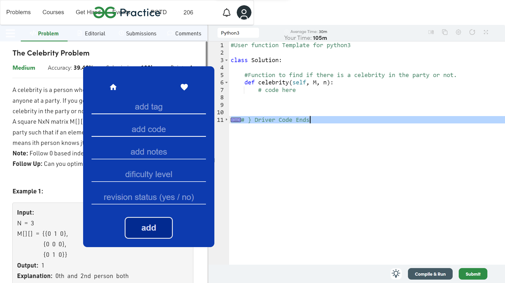

# Analyzer Website

## Created by:

#### 1) Suraj Kadam - surajskadam7@gmail.com

#### 2) Prathmesh Patil - prathmeshpatilp@gmail.com

## Features

- Using Chrome extension we can add the coding problem in one click
- Nice and clean UI
- Different Analyzing options are given
- Multiple filters are provided

### Env Variables

Create a .env file in then root and add the following

```
NODE_ENV = development
PORT = 5000
MONGO_URI = your mongodb uri
JWT_SECRET
```

## Home Page

.png>)

### Full Screen

.png>)

## Login and Registration Page

.png>)
.png>)

## How extension will look


